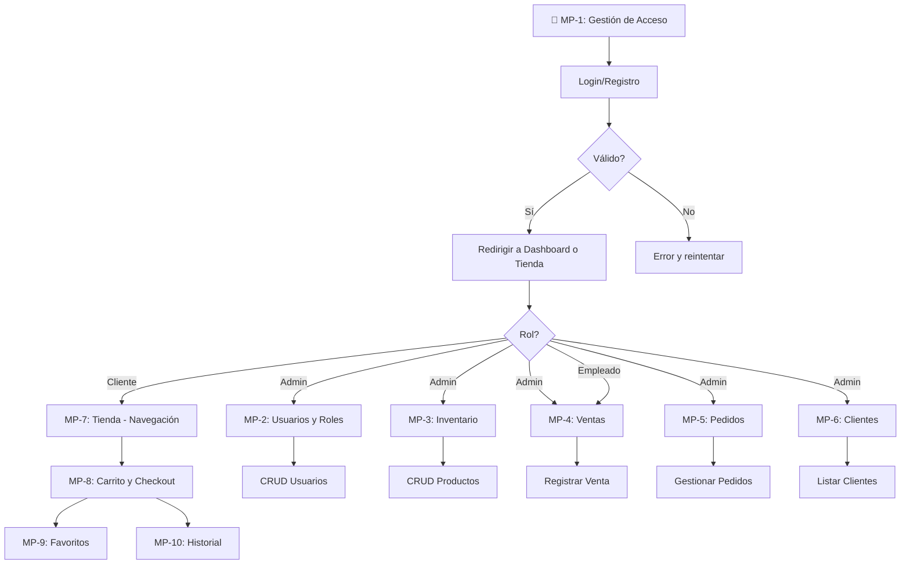
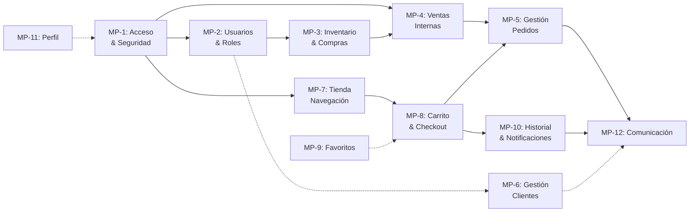

# Información del Frontend - Proyecto Selenne Boutique Authentication UI

Este documento reúne **toda la información disponible en el frontend** sobre roles, módulos y acciones que pueden llevar a cabo los distintos perfiles. Está pensado para servir como insumo (y como prompt) a Claude cuando se soliciten los siguientes artefactos:

1. **Manual de Usuario (MHU) actualizado**
2. **Matriz de historia**
3. **Ficha técnica del producto**
4. **Diagrama de casos de uso completo** (con extensiones y temporalizaciones)
5. **Documentación del diagrama de casos de uso**
6. **Manual Técnico**

> Cada vez que se requiera un formato específico se le enviará a Claude
> el ejemplo/plantilla correspondiente y ésta adaptará la salida.

---

## 1. Roles del sistema

### 1.1 Administrador
- Perfil con acceso total. Todos los métodos `tienePermiso`, `tieneModuloActivo` y
  `canDelete` devolvemos `true`.
- Puede entrar a **todos los módulos** del dashboard y gestionar cualquier
  recurso. A nivel de contexto esto significa que `normalizeRoleName` devuelve
  "ADMINISTRADOR" y el `permisosPorRol['ADMINISTRADOR']` es un array vacío (se
  trata siempre como superusuario).
- Dentro de la UI administrativa el perfil ve la barra lateral completa y no
  se aplican restricciones en la navegación.
- Ejemplos de acciones específicas: crear/editar/eliminar usuarios, roles,
  proveedores, compras, pedidos, productos, ventas; enviar notificaciones; ver
  reportes; modificar configuración global.

### 1.2 Empleado
- Mapeo interno normaliza `VENDEDOR` a `EMPLEADO` (cualquier string que contenga
  "Vendedor" o "Empleado" será convertido al mismo canonical).
- Permisos iniciales en `permisosIniciales` (ver `PermisosContext.tsx`):
  - **Módulo Productos** → sólo `productos_ver` activado.
  - **Módulo Ventas** → `ventas_ver` y `ventas_crear` activados.
- En el panel puede acceder a las secciones de inventario, categorías, colores,
  tallas, marcas, materiales, tipos-producto (todos mapeados a "productos").
- Puede registrar ventas mediante la vista `NuevaVentaView.tsx`, consultar y
  filtrar el historial con búsquedas por id, cliente, estado.
- Otros permisos comunes que el administrador suele otorgar son:
  `clientes_ver`, `inventario_actualizar`, `ventas_editar` y
  `ventas_reporte`.
- Un empleado sólo ve el menú (sidebar) con las secciones para las que tenga
  `tieneModuloActivo` verdadero. Si intenta entrar a una sección restringida se
  le redirige o muestra un mensaje de error.

### 1.3 Cliente
- Sólo interactúa con la tienda online y los recursos propios de su cuenta. El
  tipo de usuario se almacena como `tipo: 'CLIENTE'` en el array de
  `selenne_users`.
- El contexto `TiendaContext` controla su carrito (`selenne_carrito`), pedidos
  (`selenne_pedidos`) y favoritos (`selenne_favoritos`). Los cambios se guardan
  automáticamente en `localStorage` y se sincronizan con `useEffect`.
- El cliente tiene acceso a las vistas de tienda (`LandingView.tsx`,
  `ClienteView.tsx`, `CheckoutView.tsx`, `PerfilView.tsx`, etc.) y a la
  navegación correspondiente. No se le muestra la barra lateral administrativa.
- Los mensajes que recibe aparecen en `MensajesClienteView.tsx` y se distinguen
  por tipo (`aprobacion`, `rechazo`, `notificacion`, `consulta`). Se marca un
  mensaje como leído al hacer clic y se muestra un punto rojo si queda pendiente.
- El flujo de registro/login utiliza `auth/pages/RegisterView.tsx` y
  `LoginView.tsx` y, tras autenticarse, se guarda el objeto `currentUser` en
  `localStorage`. El campo `role` se normaliza mediante
  `normalizeRoleName` para el control de permisos.
---

## 2. Principales funcionalidades y acciones por rol

La siguiente tabla resume los módulos más relevantes y las operaciones
(disponibles en la interfaz) que un usuario puede realizar.

### 2.1 Administración / Gestión (ADMINISTRADOR)

- **Usuarios** (`UsuariosView.tsx`)
  - Listado con paginación interna (eliminada en la versión actual, muestra
    todos los elementos) y columnas: nombre, tipo, estado, fecha de registro,
    email.
  - Filtros y búsqueda global por nombre, tipo, email, estado y fecha.
  - Botón **+Crear** abre un modal para registrar usuarios nuevos. El formulario
    valida campos (sólo letras en nombre, números en teléfono) y asigna tipo
    (ADMINISTRADOR, EMPLEADO, CLIENTE).
  - Ver detalles: modal de lectura que muestra todos los campos y permisos
    activos.
  - Editar: modal con formulario similar al de creación. Cambiar tipo/estado.
  - Eliminar: alerta de confirmación (`AlertDialog`). Uso de `canDelete` para
    habilitar o deshabilitar el botón.
  - Acciones adicionales en cada fila: exportar datos a CSV (icono Download),
    cambiar estado (Power, X), asignar permisos, enviar correo (Mail).

- **Roles y permisos** (`RolesView.tsx`)
  - Tabla de roles con información: nombre, descripción, número de usuarios,
    estado y opciones de configuración.
  - Creación/edición mediante modales con vista de checklist jerárquico de
    módulos y permisos. Uso de `Checkbox` controlado, función `todosLosModulos`
    como plantilla inicial.
  - Guardado de permisos en el contexto global usando `setPermisos`.
  - Visualización de usuarios del rol mediante lista generada a partir de
    `selenne_users` con filtro por `tipo`.
  - Opciones especiales: activar/desactivar role, eliminar si no preexistente.

- **Proveedores** (`ProveedoresView.tsx`)
  - Similar a usuarios: tabla, búsqueda, modales para CRUD.
  - Exportar listado, marcar proveedor activo/inactivo.

- **Compras / Inventario** (`ComprasView.tsx`, `NuevaCompraView.tsx`)
  - En `ComprasView` listado de compras con filtros por proveedor, fecha y
    estado. Botón para registrar nueva compra.
  - Modal/forma de `NuevaCompraView` donde se escoge proveedor, se agregan
    productos (autocomplete), cantidades, precios unitarios. Se calcula total
    automáticamente.
  - Edición de compras existentes: modificar ítems, cantidades, estado.
  - Los inventarios (tallas, colores, materiales, etc.) se gestionan en vistas
    propias (`CategoriasView.tsx`, `TallasView.tsx`, `ColoresView.tsx`,
    `MaterialesView.tsx`, `MarcasView.tsx`, `TiposProductoView.tsx`). Cada
    una replicando el patrón CRUD.

- **Pedidos** (`PedidosView.tsx`)
  - Lista de pedidos recibidos por la tienda (sin ventas internas). Permite
    filtrar por estado, buscar por id/email/cliente.
  - Vista detallada de pedido con productos, datos de envío y botón para cambiar
    estado. Cuando se cambia el estado se puede enviar una notificación al
    cliente utilizando `useNotificaciones`.

- **Clientes** (`ClientesView.tsx`)
  - Tabla similar a usuarios, pero card con icono y nombre.
  - Modal de detalles que muestra: nombre, email, teléfono, dirección, fecha de
    registro, compras totales y lista de pedidos asociados (con resumen y
    estados coloreados). 
  - Funcionalidad de edición comparable a usuarios y persistencia en
    `selenne_clientes`.

- **Ventas** (`VentasView.tsx`, `NuevaVentaView.tsx`)
  - `VentasView` ofrece filtro por estado (Todos, Aprobada, Pendiente,
    Completada, Rechazada), búsqueda libre y botón Exportar.
  - Modal de detalle de venta muestra ítems, totales, método de pago y botón
    para volver.
  - `NuevaVentaView` permite construir una venta: añadir productos del
    inventario (autocomplete con selección de talla color), cantidades, y
    calcular total / aplicar descuentos.
  - Al confirmar se guarda la venta en el estado de `pedidos` y se muestra una
    notificación (`toast`). También se puede invocar `onNavigateToNuevaVenta`.

- **Notificaciones administrativas** (`NotificacionesAdminView.tsx`)
  - Lista de mensajes enviados/recibidos; crear nuevo mensaje mediante modal.
  - Filtros por destinatario (cliente/empleado), tipo de mensaje y fecha.

- **Configuración general** (visible según permisos)
  - Opciones de sistema (nombre de la empresa, email corporativo,
    integraciones) presentes en rutas bajo `configuracion`.
  - El contenido de estas secciones guarda los datos en `localStorage` y en
    (futuro) podría ser enviado a backend.


### 2.2 Funcionalidades de empleado

- **Productos / Inventario**
  - Visualizar listados de productos y atributos asociados (categorías,
    colores, tallas, etc.).
  - Según permisos puede **crear/editar/eliminar** elementos del inventario.
  - Si no tiene permiso de creación/edición aparecen solo botones de vista.

- **Ventas**
  - Registrar nuevas ventas.
  - Ver listado de ventas realizadas por él/ella.
  - Puede acceder a la caja o gestionar inventario si el rol lo habilita.

- **Clientes** (si el permiso `clientes_ver` está activo)
  - Consultar información básica del cliente vinculado a una venta.

- **Módulos adicionales**
  - Cualquier otro módulo que el Administrador permita mediante la pantalla
    de Roles y Permisos.

### 2.3 Funcionalidades de cliente

Los componentes bajo `src/features/tienda` definen la experiencia de tienda. El
rol de cliente accede a estas rutas mediante navegación superior o botones
"Comprar" en los productos.

- **Navegación y Landing** (`LandingView.tsx`)
  - Explorar colecciones, ver banners y productos destacados. La página carga
    datos de `openapi.yaml` para mostrar catálogos estáticos.
  - Acceso rápido a categorías principales mediante enlaces y buscador global.

- **Catálogo / Detalle de producto** (`ClienteView.tsx`)
  - Búsqueda de productos con autocomplete y filtros por categoría, talla,
    color. Los resultados se muestran en rejilla responsiva.
  - Página de detalle incluye carrusel de imágenes (`ImageCarousel.tsx`),
    descripción, precio, tallas, colores disponibles y botón "Agregar al
    carrito".
  - Se aplican verificaciones de stock e indicadores de "Nuevo" o "Sale".

- **Carrito de compras**
  - `TiendaContext` expone `agregarAlCarrito`, `removerDelCarrito`,
    `actualizarCantidad`, etc. El componente del carrito muestra ítems con
    selección de talla/color y botones para modificar cantidad o eliminar.
  - Cálculo en tiempo real del total, envío de toast notifications al agregar o
    modificar.
  - **Checkout** (`CheckoutView.tsx`): formulario para datos de envío,
    opciones de pago. Validación de campos obligatorios. Enviar =>
    `agregarPedido` almacena la compra en `selenne_pedidos` y limpia el carrito.
  - Todas las acciones de carrito/pedido se sincronizan con `localStorage` y
    con otros tabs mediante eventos `storage` y `BroadcastChannel`.

- **Favoritos** (`FavoritosView.tsx`)
  - Lista de productos marcados con icono de corazón. Se pueden eliminar o ir
    al producto para agregar al carrito.
  - Estado almacenado en `selenne_favoritos`.

- **Mis pedidos / Historial**
  - Vista muestra los pedidos que se guardan en el contexto de tienda o
    `selenne_pedidos`. Cada pedido muestra fecha, total y estado. Estado
    coloreado similar a la vista de ventas del admin.
  - El cliente puede volver a realizar un pedido anterior (botón de
    "Reordenar" que copia los ítems al carrito).

- **Mensajes** (`MensajesClienteView.tsx`)
  - Recibir notificaciones de aprobación/rechazo/consulta del pedido.
  - Marcar como leídos; los mensajes sin leer aparecen con borde rosa y punto
    rojo. El flujo usa `useMensajes` para gestión y `marcarComoLeido`.

- **Perfil** (`PerfilView.tsx`)
  - Consultar y editar datos personales almacenados en `selenne_users`.
  - Cambiar contraseña (no implementada), actualizar teléfono y dirección.

- **Registro y autenticación** (`auth/pages/LoginView.tsx` y
  `RegisterView.tsx`)
  - Crear cuenta de cliente, iniciar sesión.
  - Generación de credenciales temporales para clientes mediante
    `credentialGenerator.ts`.
  - Posterior al login se guarda `currentUser` en `localStorage` y se
    redirige según rol (dashboard o tienda).


---

## 3. Estructura de datos principales

- `permiso`: `{ id: string; label: string; checked: boolean }`
- `PermissionModule`: `{ id: string; name: string; permissions: Permiso[]; checked: boolean }`
- `User`: `{ id: string; nombre: string; cargo: string; tipo: UserType; email: string; estado: UserStatus; fechaRegistro: string; telefono?: string; direccion?: string; avatar?: string }`
- `Producto`:
  ```ts
  interface Producto {
    id: number; nombre: string; precio: number; precioOriginal?: number; imagen: string;
    imagenes?: string[]; categoria: 'mujer'|'accesorios'|'sale';
    tipoProducto: string; tallas: string[]; colores?: string[];
    materiales?: string[]; rating: number; badge?: string|null; nuevo: boolean;
  }
  ```
- `CarritoItem` extiende `Producto` añadiendo `cantidad`, `tallaSeleccionada` y `colorSeleccionado`.
- `Pedido` contiene `id`, `fecha`, `items: CarritoItem[]`, `total`, `estado`, `metodoPago`, `datosEnvio`.

### Claves de `localStorage` y formato

| Clave               | Contenido                    | Comentarios                        |
|---------------------|------------------------------|------------------------------------|
| `selenne_users`     | Array de `User`              | usuarios de todos los tipos        |
| `selenne_clientes`  | Array de clientes (subset)   | usado en `ClientesView`           |
| `selenne_carrito`   | Array de `CarritoItem`       | sincronizado tras cada cambio      |
| `selenne_favoritos` | Array de ids de producto     | lista de deseos                    |
| `selenne_pedidos`   | Array de `Pedido`            | pedidos realizados en tienda
|

Los datos se almacenan en `localStorage` y se sincronizan entre pestañas
mediante eventos `storage` y `BroadcastChannel` (canales `selenne_*_channel`).
En cada `useEffect` relevante se recarga el estado para mantener consistencia
cuando se detecta un cambio externo.

---

## 4. Patrón de permisos y secciones

`PermisosContext` contiene:

- función `normalizeRoleName` con mapeo entre nombres libres y
  canonical (VENDEDOR → EMPLEADO, ADMIN → ADMINISTRADOR).
- `permisosIniciales` con módulos habilitados por rol.
- `sectionToModuleMapping`: relación entre la ruta/section del
  menú y el módulo de permisos.
- utilitarios: `canAccessSection(section)`, `canDelete()`.

Esto permite generar una **matriz de historia / trazabilidad** donde cada
ruta y acción está ligada a un permiso determinado.

---

## 5. Sugerencia de caso de uso (ejemplo)

- **UC-01: Iniciar sesión** (cliente/empleado/admin)
  - Precondición: usuario registrado.
  - Flujo principal: introducir credenciales ‑> autenticación ‑> redirigir a
    dashboard o tienda según rol.
  - Extensiones:
    - contraseña olvidada (entrada no implementada pero se puede añadir).
    - sesión expirada / reconexión.

- **UC-02: Registrar venta (Empleado)**
  - Pre: empleado logueado con permisos de ventas (`ventas_crear`).
  - Flujo: abrir nueva venta → agregar productos existencias → seleccionar
    tallas/colores → ingresar cantidad → confirmar total → guardar → mostrar
    notificación (toast) y opcionalmente imprimir ticket.
  - Posible extensión: anular venta, generar notificación a cliente.

- **UC-03: Crear usuario (Administrador)**
  - Pre: administrador logueado.
  - Flujo: ingresar a Usuarios → clic en +Crear → llenar formulario → validar
    datos → enviar → usuario agregado a `selenne_users` y listado actualizado.
  - Extensiones: asignar permisos avanzados, notificar por correo.

- **UC-04: Actualizar rol y permisos**
  - Pre: administrador en pantalla Roles.
  - Flujo: seleccionar rol → editar módulos/checkbox → guardar → los cambios
    se aplican inmediatamente a `PermisosContext`.
  - Extensiones: heredar permisos de otro rol, copiar permisos.

- **UC-05: Hacer un pedido (Cliente)**
  - Pre: cliente autenticado.
  - Flujo: navegar por catálogo → seleccionar producto → elegir talla/color →
    agregar al carrito → ir a checkout → completar datos de envío y método de
    pago → confirmar pedido → se crea registro en `selenne_pedidos` y vacía el
    carrito.
  - Extensiones: aplicar descuento, calcular envío, reordenar

- **UC-06: Revisar mensajes (Cliente y Admin)**
  - Pre: usuario logueado.
  - Flujo: abrir Mensajes → visualizar lista → marcar como leídos al hacer clic.
  - Extensiones: responder mensaje, filtrar por tipo.

(Agregar tantos casos como se requiera en el diagrama final.)

---

## 6. ANEXO A: Información para Matriz MHU (Manual de Historia de Usuario)

### 6.1 Actores identificados

| Actor | Tipo | Responsabilidades |
|-------|------|-------------------|
| Administrador | Internal | Gestión total de usuarios, roles, inventario, ventas, compras y configuración del sistema |
| Empleado | Internal | Registro de ventas, consulta de inventario, visualización de clientes, gestión de tallas/colores |
| Cliente | External | Navegación en tienda, búsqueda de productos, carrito, checkout, visualización de pedidos y mensajes |

### 6.2 Historias de usuario por rol

#### **Administrador**

| ID | Historia | Aceptación |
|----|---------|-----------|
| US-ADM-001 | Como administrador quiero listar todos los usuarios del sistema para auditar accesos | Visualizar tabla con búsqueda, filtros por tipo/estado; exportar a CSV |
| US-ADM-002 | Como administrador quiero crear un nuevo usuario para onboarding de empleados/clientes | Modal con validaciones; usuario se agrega a `selenne_users` y sistema notifica |
| US-ADM-003 | Como administrador quiero editar datos de usuario para actualizar información | Modal con form; cambios persisten en `localStorage` |
| US-ADM-004 | Como administrador quiero eliminar usuario para gestionar accesos | Alerta de confirmación; requiere permiso `canDelete` |
| US-ADM-005 | Como administrador quiero crear/editar roles y asignar permisos para controlar acceso modulares | Vista jerárquica de módulos/permisos; guardado en `PermisosContext` |
| US-ADM-006 | Como administrador quiero visualizar usuarios por rol para auditar distribución de accesos | Filtro en RolesView; lista de usuarios con estado |
| US-ADM-007 | Como administrador quiero gestionar proveedores (alta/baja/edición) para mantener base de datos de compras | CRUD con búsqueda y modales |
| US-ADM-008 | Como administrador quiero registrar compras a proveedores para mantener inventario | Formulario en NuevaCompraView; agregar items, cantidades, precios |
| US-ADM-009 | Como administrador quiero gestionar atributos de productos (categorías, tallas, colores, marcas, materiales) para mantener catálogo | Vistas CRUD por cada atributo (CategoriasView, TallasView, etc.) |
| US-ADM-010 | Como administrador quiero visualizar todos los pedidos de tienda para gestionar cumplimiento | Tabla filtrable por estado; detalles con datos de envío |
| US-ADM-011 | Como administrador quiero cambiar estado de pedido para notificar avance al cliente | Dropdown de estado en detalle de pedido; enviar notificación |
| US-ADM-012 | Como administrador quiero visualizar clientes registrados para contactarlos | Tabla con búsqueda; detalles incluyen historial de pedidos |
| US-ADM-013 | Como administrador quiero editar datos de cliente para corregir información | Modal con form; cambios en `selenne_clientes` y `selenne_users` |
| US-ADM-014 | Como administrador quiero listar ventas registradas para auditar transacciones | Tabla filtrable por estado/fecha; exportar; ver detalles |
| US-ADM-015 | Como administrador quiero crear/editar notificaciones para comunicar a clientes y empleados | Modal de composición; tipo de mensaje (aprobación, rechazo, etc.) |

#### **Empleado**

| ID | Historia | Aceptación |
|----|---------|-----------|
| US-EMP-001 | Como empleado quiero visualizar listado de productos disponibles para saber qué vender | Tabla con búsqueda; solo lectura |
| US-EMP-002 | Como empleado quiero registrar una nueva venta para procesar transacciones | Modal/formulario; agregar productos, cantidades, talla/color; calcular total |
| US-EMP-003 | Como empleado quiero visualizar historial de ventas realizadas para auditar mis transacciones | Tabla filtrable; detalles con datos del cliente |
| US-EMP-004 | Como empleado quiero ver información de atributos (colores, tallas, materiales) para asistir cliente | Acceso de lectura a vistas de inventario |
| US-EMP-005 | Como empleado quiero consultar información básica del cliente para personalizar atención | Modal con datos del cliente (si permiso `clientes_ver` está activo) |

#### **Cliente**

| ID | Historia | Aceptación |
|----|---------|-----------|
| US-CLI-001 | Como cliente quiero explorar catálogo de productos para descubrir colecciones | Landing y navegación por categoría; ver banners y destacados |
| US-CLI-002 | Como cliente quiero buscar un producto específico por nombre/categoría para encontrar rápido | Búsqueda con autocomplete; filtros por categoría, talla, color |
| US-CLI-003 | Como cliente quiero ver detalles de un producto incluyendo imágenes y disponibilidad para tomar decisión | Página de detalle con carrusel, descripción, tallas, colores, rating |
| US-CLI-004 | Como cliente quiero seleccionar talla y color para especificar mi preferencia | Dropdowns/radio buttons en detalle; validación antes de agregar |
| US-CLI-005 | Como cliente quiero agregar producto al carrito para preparar mi compra | Botón "Agregar al carrito"; toast de confirmación; actualización de carrito |
| US-CLI-006 | Como cliente quiero ver mi carrito con items y total para revisar compra | Modal/página de carrito; mostrar items, cantidades, precio unitario, total |
| US-CLI-007 | Como cliente quiero modificar cantidad de item en carrito para ajustar orden | Spinners/inputs de cantidad; recalcular total automáticamente |
| US-CLI-008 | Como cliente quiero eliminar un item del carrito para descartar productos | Botón delete; confirmación opcional |
| US-CLI-009 | Como cliente quiero proceder al checkout para completar compra | Botón Checkout; redirigir a formulario de envío |
| US-CLI-010 | Como cliente quiero ingresar datos de envío (nombre, dirección, teléfono) para recibir producto | Form con validaciones; guardar en `datosEnvio` del pedido |
| US-CLI-011 | Como cliente quiero elegir método de pago (contra-entrega o transferencia) para definir forma de pago | Radio buttons; mostrar instrucciones según opción |
| US-CLI-012 | Como cliente quiero confirmar pedido para completar transacción | Resumen de orden; botón Confirmar; crear registro en `selenne_pedidos` |
| US-CLI-013 | Como cliente quiero marcar productos como favoritos para guardar para después | Icono de corazón en producto; agregar a `selenne_favoritos` |
| US-CLI-014 | Como cliente quiero acceder a lista de favoritos para ver guardados | Página de favoritos; opción de agregar al carrito desde allí |
| US-CLI-015 | Como cliente quiero visualizar mis pedidos realizados para rastrear compras | Lista de pedidos con fecha, total, estado; detalles al hacer clic |
| US-CLI-016 | Como cliente quiero recibir notificaciones de estado de pedido para saber avance | Sección Mensajes; mostrar notificaciones de aprobación/rechazo/consulta |
| US-CLI-017 | Como cliente quiero marcar mensajes como leídos para organizar notificaciones | Clic en mensaje; desaparace punto rojo |
| US-CLI-018 | Como cliente quiero actualizar mi perfil (teléfono, dirección) para mantener datos actuales | Página de perfil con form; guardar en `selenne_users` |
| US-CLI-019 | Como cliente quiero registrarme en el sistema para crear cuenta y acceder a tienda | Formulario de registro en RegisterView; validaciones; crear user en `selenne_users` |
| US-CLI-020 | Como cliente quiero iniciar sesión para acceder a mi cuenta | LoginView; verificar credenciales; guardar `currentUser` en `localStorage` |

---

## 7. ANEXO B: Información para Ficha Técnica del Producto

### 7.1 Datos técnicos generales

- **Nombre del Proyecto:** Selenne Boutique Authentication UI (Community)
- **Tipo de Aplicación:** Web Application (SPA - Single Page Application)
- **Stack Tecnológico:** 
  - Frontend: React 18+, TypeScript, Vite
  - UI Components: Radix UI, Shadcn/ui
  - Estado: React Context API
  - Persistencia: localStorage
  - Sincronización: BroadcastChannel API
  - Notificaciones: Sonner.dev (Toast)
- **Navegador Soportado:** Chrome, Firefox, Safari, Edge (versiones recientes)

### 7.2 Módulos y componentes principales

| Módulo | Ruta | Componente | Funcionalidad |
|--------|------|-----------|--------------|
| Autenticación | `src/features/auth` | LoginView, RegisterView | Login/Registro de usuarios |
| Dashboard Admin | `src/features/dashboard` | DashboardHome, EmpleadoHome | Inicio según rol |
| | | UsuariosView | Gestión de usuarios |
| | | RolesView | Gestión de roles y permisos |
| | | ProveedoresView | Gestión de proveedores |
| | | ComprasView, NuevaCompraView | Registro de compras |
| | | CategoriasView, TallasView, ColoresView | Gestión de atributos |
| | | MaterialesView, MarcasView, TiposProductoView | Más atributos |
| | | ProductosView | Gestión de productos |
| | | PedidosView | Gestión de pedidos |
| | | ClientesView | Gestión de clientes |
| | | VentasView, NuevaVentaView | Registro de ventas |
| | | NotificacionesAdminView | Notificaciones admin |
| | | PerfilView | Perfil de usuario |
| Tienda Online | `src/features/tienda` | LandingView | Página principal |
| | | ClienteView | Catálogo de productos |
| | | CheckoutView | Proceso de compra |
| | | FavoritosView | Lista de favoritos |
| | | PerfilView | Perfil del cliente |
| | | MensajesClienteView | Notificaciones de cliente |
| Contextos Globales | `src/shared/contexts` | AuthContext | Autenticación y usuario actual |
| | | PermisosContext | Control de permisos y roles |
| | | TiendaContext | Carrito, favoritos, pedidos |
| | | PedidosAdminContext | Pedidos del sistema |
| | | MensajesContext | Notificaciones y mensajes |

### 7.3 Datos persistidos

| Clave localStorage | Formato | Tamaño Aprox | Actualización | Sincronización |
|-------------------|---------|--------------|---------------|-----------------|
| `currentUser` | Object (User) | ~500 B | Al login | Manual (recarga) |
| `selenne_users` | Array[User] | ~50 KB (1000 users) | Creación/edición user | BroadcastChannel + storage event |
| `selenne_clientes` | Array[Cliente] | ~30 KB (500 clients) | Edición cliente | BroadcastChannel |
| `selenne_carrito` | Array[CarritoItem] | ~10 KB | Agregar/eliminar/actualizar | useEffect |
| `selenne_favoritos` | Array[number] | ~1 KB | Toggle favorito | useEffect |
| `selenne_pedidos` | Array[Pedido] | ~100 KB | Nueva compra confirmada | useEffect |
| `permisosPorRol` | RolePermissions | ~5 KB | Edición de rol | useState + localStorage |

### 7.4 Características de seguridad (v Actual)

- ✅ Control de acceso por rol (ADMINISTRADOR, EMPLEADO, CLIENTE)
- ✅ Normalización de nombres de rol (mapeo VENDEDOR → EMPLEADO, ADMIN → ADMINISTRADOR)
- ✅ Validaciones en formularios (sólo letras, números, emails)
- ✅ Permisos granulares por módulo y acción
- ❌ Encriptación de contraseña (almacenadas en plano en localStorage)
- ❌ Backend real (sin API calls)
- ❌ Autenticación multifactor
- ❌ Sessions con expiración

### 7.5 Límites y consideraciones

- **Capacidad de datos:** localStorage limitado (~5-10 MB por dominio) → máx ~500 usuarios
- **Sincronización:** entre pestañas en el mismo navegador (BroadcastChannel)
- **Offline:** funciona en modo offline (datos en localStorage)
- **Performance:** sin paginación backend, carga todos los items en UI
- **Auditoría:** no hay logs de cambios; historial de transacciones solo en `localStorage`

---

## 8. ANEXO C: Información para Diagrama de Casos de Uso (Macroprocesos)

### 8.1 Macroprocesos identificados

#### **MP-1: Gestión de Acceso y Seguridad**
Actores: Administrador, Empleado, Cliente
- UC-01: Iniciar sesión
- UC-02: Registrarse (cliente)
- UC-03: Cerrar sesión
- UC-04: Recuperar contraseña (extensión futura)

#### **MP-2: Administración de Usuarios y Roles**
Actor: Administrador
- UC-05: Crear usuario
- UC-06: Editar usuario
- UC-07: Eliminar usuario
- UC-08: Listar usuarios
- UC-09: Crear rol
- UC-10: Editar rol
- UC-11: Eliminar rol
- UC-12: Asignar permisos a rol
- UC-13: Activar/desactivar usuario

#### **MP-3: Gestión de Inventario y Compras**
Actor: Administrador
- UC-14: Crear proveedor
- UC-15: Editar proveedor
- UC-16: Eliminar proveedor
- UC-17: Registrar compra a proveedor
- UC-18: Editar compra
- UC-19: Crear categoría/atributo de producto
- UC-20: Editar categoría/atributo
- UC-21: Eliminar categoría/atributo
- UC-22: Crear producto
- UC-23: Editar producto
- UC-24: Eliminar producto

#### **MP-4: Ventas Internas (Dashboard)**
Actor: Empleado, Administrador
- UC-25: Registrar venta manual
- UC-26: Editar venta
- UC-27: Anular venta
- UC-28: Listar ventas
- UC-29: Filtrar ventas por criterios
- UC-30: Exportar reporte de ventas

#### **MP-5: Gestión de Pedidos de Tienda**
Actor: Administrador
- UC-31: Visualizar pedidos recibidos
- UC-32: Ver detalles de pedido
- UC-33: Cambiar estado de pedido
- UC-34: Enviar notificación a cliente
- UC-35: Generar etiqueta de envío (extensión)

#### **MP-6: Gestión de Clientes**
Actor: Administrador
- UC-36: Listar clientes
- UC-37: Ver detalles de cliente (con historial)
- UC-38: Editar información de cliente
- UC-39: Visualizar pedidos de cliente
- UC-40: Enviar mensaje a cliente

#### **MP-7: Tienda Online - Navegación y Búsqueda**
Actor: Cliente
- UC-41: Acceder a landing page
- UC-42: Navegar por categorías
- UC-43: Buscar producto
- UC-44: Filtrar productos por criterios
- UC-45: Ver detalle de producto

#### **MP-8: Carrito y Checkout**
Actor: Cliente
- UC-46: Agregar producto al carrito
- UC-47: Modificar cantidad en carrito
- UC-48: Eliminar item del carrito
- UC-49: Vaciar carrito
- UC-50: Proceder a checkout
- UC-51: Ingresar datos de envío
- UC-52: Seleccionar método de pago
- UC-53: Confirmar pedido
- UC-54: Mostrar confirmación de orden

#### **MP-9: Favoritos**
Actor: Cliente
- UC-55: Marcar producto como favorito
- UC-56: Acceder a lista de favoritos
- UC-57: Eliminar de favoritos
- UC-58: Agregar favorito al carrito

#### **MP-10: Historial y Notificaciones (Cliente)**
Actor: Cliente
- UC-59: Ver mis pedidos
- UC-60: Ver detalles de pedido anterior
- UC-61: Reordenar desde historial
- UC-62: Recibir notificación de estado
- UC-63: Marcar notificación como leída
- UC-64: Filtrar notificaciones por tipo

#### **MP-11: Perfil de Usuario**
Actor: Empleado, Administrador, Cliente
- UC-65: Ver perfil personal
- UC-66: Editar información de perfil
- UC-67: Cambiar contraseña (extensión)

#### **MP-12: Notificaciones y Comunicación**
Actor: Administrador
- UC-68: Crear notificación para cliente
- UC-69: Crear notificación para empleado
- UC-70: Visualizar historial de notificaciones
- UC-71: Filtrar notificaciones

---

### 8.2 Casos de uso detallados (Formato estándar IEEE 830)

**UC-01: Iniciar Sesión**
- **Actor Principal:** Cliente, Empleado, Administrador
- **Precondición:** Usuario registrado en el sistema
- **Flujo Principal:**
  1. Actor accede a LoginView
  2. Sistema muestra formulario (email, contraseña)
  3. Actor ingresa credenciales
  4. Sistema valida en `selenne_users`
  5. Si es válido: almacena `currentUser` en `localStorage` y redirige (admin → dashboard, cliente → tienda)
  6. Si es inválido: muestra error y permite reintentar
- **Flujo Alternativo - Extensión E1:** Contraseña olvidada
  - 3a. Actor hace clic en "Olvidé mi contraseña"
  - 3b. Sistema redirige a pantalla de recuperación (no implementada)
  - 3c. Actor ingresa email
  - 3d. Sistema envía link de recuperación (futura implementación con backend)
- **Postcondición:** Usuario autenticado y sesión activa
- **Tiempo Estimado:** 30 segundos - 2 minutos (incluye reintentos)

**UC-05: Crear Usuario (Administrador)**
- **Actor Principal:** Administrador
- **Precondición:** Admin autenticado en DashboardHome
- **Flujo Principal:**
  1. Admin navega a Usuarios
  2. Sistema muestra tabla de usuarios existentes
  3. Admin hace clic en botón "+Crear"
  4. Sistema abre modal CreateUserDialog
  5. Admin completa formulario (nombre, email, teléfono, dirección, tipo: ADMIN/EMPLEADO/CLIENTE)
  6. Admin hace clic en "Guardar"
  7. Sistema valida campos (sólo letras en nombre, números en teléfono, email válido)
  8. Si válido: crea objeto User, lo agrega a `selenne_users`, muestra toast "Usuario creado"
  9. Sistema recarga tabla
  10. Si no válido: muestra errores en formulario
- **Flujo Alternativo - E1:** Duplicado de email
  - 8a. Sistema detecta email existente
  - 8b. Muestra error "Email ya registrado"
  - 8c. Admin modifica email y reintenta
- **Postcondición:** Nuevo usuario en sistema, accesible para login
- **Tiempo Estimado:** 1-3 minutos

**UC-46: Agregar Producto al Carrito (Cliente)**
- **Actor Principal:** Cliente
- **Precondición:** Cliente autenticado, viendo producto en ClienteView
- **Flujo Principal:**
  1. Cliente hace clic en botón "Agregar al carrito"
  2. Si no ha seleccionado talla: Sistema muestra error "Selecciona una talla"
  3. Cliente selecciona talla (obligatorio)
  4. Cliente selecciona color (opcional)
  5. Cliente ingresa cantidad (default = 1)
  6. Cliente hace clic en "Agregar"
  7. Sistema valida disponibilidad (stock > cantidad)
  8. Si válido: crea CarritoItem, lo agrega a `TiendaContext`, actualiza `localStorage` ("selenne_carrito")
  9. Sistema muestra toast "Producto agregado al carrito"
  10. Actualiza badge de cantidad en menú principal
- **Flujo Alternativo - E1:** Producto ya en carrito
  - 8a. Sistema detecta CarritoItem con mismo id/talla/color
  - 8b. En lugar de crear, incrementa cantidad existente
  - 8c. Muestra toast "Cantidad actualizada"
- **Flujo Alternativo - E2:** Stock insuficiente
  - 7a. Sistema valida: stock disponible < cantidad solicitada
  - 7b. Muestra error "Stock insuficiente. Disponible: X"
  - 7c. Cliente puede reducir cantidad o cancelar
- **Postcondición:** Item en carrito, sincronizado con localStorage y sidebar
- **Tiempo Estimado:** 30 segundos - 2 minutos

**UC-50: Proceder a Checkout**
- **Actor Principal:** Cliente
- **Precondición:** Cliente tiene item(s) en carrito, hace clic en "Ir a Checkout"
- **Flujo Principal:**
  1. Sistema redirige a CheckoutView
  2. Sistema muestra resumen de carrito (items, cantidades, total)
  3. Cliente revisa y puede volver a editar (botón "Editar carrito")
  4. Cliente hace clic en "Continuar a envío"
  5. Sistema muestra formulario de datos de envío
  6. Cliente completa: nombre, documento, dirección, ciudad, teléfono, notas (opt)
  7. Cliente valida y hace clic en "Siguiente"
  8. Sistema muestra opciones de pago: radio buttons (contra-entrega, transferencia)
  9. Si transferencia: muestra instrucciones bancarias
  10. Cliente selecciona método y hace clic en "Confirmar pedido"
  11. Sistema crea Pedido, lo agrega a `selenne_pedidos`, vacia carrito
  12. Sistema muestra pantalla de confirmación con número de orden
  13. Sistema opcionalmente envía email de confirmación (futuro)
- **Flujo Alternativo - E1:** Validación fallida en datos
  - 7a. Sistema detecta campo requerido vacío
  - 7b. Muestra error "Por favor completa campo X"
  - 7c. Cliente corrige y reintenta
- **Postcondición:** Pedido creado en `selenne_pedidos`, cliente puede seguir tracking
- **Tiempo Estimado:** 3-5 minutos

...más casos de uso con este nivel de detalle para cada MP...

---

### 8.3 Diagrama de flujo por macroproceso (Mermaid)



---

## 9. ANEXO D: Documentación del Diagrama de Casos de Uso

### 9.1 Descripción general del modelo

El sistema Selenne Boutique está diseñado como una solución omnicanal que integra:
- **Capa administrativa interna** para gestión de inventario, usuarios y ventas directas
- **Capa de tienda online** para clientes finales
- Un **sistema modular de permisos** que controla acceso por rol

Los 12 macroprocesos identificados cubren desde autenticación hasta notificaciones, formando un ciclo completo de negocio.

### 9.2 Relaciones entre macroprocesos



### 9.3 Matriz de responsabilidad (RACI)

| Caso de Uso | Admin | Empleado | Cliente | Sistema |
|-------------|-------|----------|---------|---------|
| UC-01 Iniciar sesión | - | R | R | I |
| UC-05 Crear usuario | R | - | - | I |
| UC-25 Registrar venta | R | R | - | I |
| UC-46 Agregar al carrito | - | - | R | I |
| UC-50 Checkout | - | - | R | I |
| UC-59 Ver mis pedidos | R | R | R | I |

R=Responsable, I=Informado, C=Consultado, A=Aprobación

### 9.4 Flujos críticos y tiempos

| Flujo | Inicio | Fin | Tiempo | Crítico |
|-------|--------|-----|--------|---------|
| Registrar venta | NuevaVentaView | Toast confirmación | 2-5 min | Sí |
| Procesar pedido | Landing → Checkout | Confirmación | 5-10 min | Sí |
| Crear usuario | UsuariosView | Usuario en sistema | 1-3 min | No |
| Cambiar rol/permisos | RolesView | Aplicación inmediata | 2-4 min | No |

### 9.5 Puntos de integración con backend (Futuro)

- Autenticación (Auth0, JWT)
- Persistencia (Base de datos SQL)
- Notificaciones por email
- Procesamiento de pagos (Stripe, PayU)
- Tracking de envíos

---


> A continuación se proporciona toda la información necesaria sobre el
> frontend. Utilízala como contexto para generar los artefactos que se
> solicitarán. Cada vez que quiera un documento en un formato específico le
> entregaré esa plantilla.

```
/*********************************************************************************
 * CONTEXTO: Proyecto "Selenne Boutique Authentication UI" (UI React + Vite)
 * Roles: ADMINISTRADOR, EMPLEADO, CLIENTE
 * Módulos principales: Usuarios, Roles, Proveedores, Compras, Pedidos,
 * Clientes, Productos, Ventas, Notificaciones, Tienda Online, Mensajes,
 * Configuración, etc.
 * Persistencia: localStorage (selenne_*). Sin backend real.
 * Los permisos y accesos se manejan mediante contexto React `PermisosContext`.
 * Ejemplos de tipos de datos y estructura se encuentran en el propio código.
 * El cliente sólo accede a las vistas de tienda; los demás roles usan el
 * dashboard administrativo.
 *********************************************************************************/

// aquí pegar información de roles/acciones/módulos como texto libre
// (usar secciones 1‑4 del presente archivo)

// Futura interacción con Claude:
// - "Genera un Manual de Usuario utilizando la información anterior; el
//   documento debe seguir este formato: [aquí va plantilla proporcionada]"
// - "Crea una matriz de historia que relacione cada caso de uso con las
//   rutas y permisos del frontend"
// - "Dibuja un diagrama de casos de uso en mermaid describiendo los
//   actores y flujos (incluir extensiones y tiempos estimados)"
// - "Genera la documentación textual del diagrama precedente"
// - "Elabora un Manual Técnico que explique la arquitectura, la gestión de
//   permisos, la persistencia y los contextos principales"

// Instrucciones de estilo generales:
// - Utilizar lenguaje claro, amigable y adecuado para un público no
//   técnico en el MHU.
// - Incluir tablas, listas numeradas y diagramas cuando convenga.
// - El manual técnico debe ser exhaustivo pero conciso; se puede referenciar
//   tipos y rutas de archivos.
// - Actualiza este documento cada vez que se añada una nueva vista,
//   permiso o flujo de negocio. Claude debe leer la versión más reciente al
//   generar artefactos.

```

---

## 10. PROMPTS ESPECÍFICOS PARA CLAUDE POR ARTEFACTO

### 10.1 Para generar Manual de Usuario (MHU)

**CONTEXTO:**
[Copiar Secciones 1-4 + ANEXO A (6.1 a 6.2)]

**TAREA:**
Genera un Manual de Usuario profesional que incluya:
1. Portada (nombre proyecto, versión, fecha)
2. Índice de contenidos
3. Introducción (objetivos, públicos)
4. Descripción por rol con responsabilidades y módulos
5. Guía paso a paso para tareas principales de cada rol
6. Glosario de términos
7. FAQs
8. Contacto y soporte

**FORMATO:**
- Lenguaje claro, no técnico
- Incluir descripciones mockups de pantallas
- Tablas para comparar funcionalidades por rol
- Máximo 25 páginas formato A4

### 10.2 Para generar Matriz de Historia de Usuario

**CONTEXTO:**
[ANEXO A - Secciones 6.1 a 6.2]

**TAREA:**
Crea Matriz de Historia completa con:
1. Tabla con columnas: ID | Historia | Aceptación | Prioridad | Complejidad | Dependencias
2. Formato: Como [actor] quiero [acción] para [beneficio]
3. Total ~90-100 historias
4. Ordenado por rol luego por prioridad
5. Subtotales y análisis de dependencias

**FORMATO:**
- Tabla markdown o CSV
- Incluir roadmap sugerido por trimestres

### 10.3 Para generar Ficha Técnica

**CONTEXTO:**
[ANEXO B - Secciones 7.1 a 7.5]

**TAREA:**
Ficha Técnica con:
1. Identificación: nombre, versión, stack
2. Módulos y componentes (tabla jerárquica)
3. Requisitos funcionales y no funcionales
4. Modelo de datos simplificado
5. Seguridad actual y brechas
6. Limitaciones y roadmap

**FORMATO:**
- Documento técnico 10-15 páginas
- Incluir diagramas: arquitectura, BD

### 10.4 Para generar Diagrama de Casos de Uso

**CONTEXTO:**
[ANEXO C - Secciones 8.1 a 8.3]

**TAREA:**
Diagrama en Mermaid con:
1. Vista macro: 12 macroprocesos, actores, relaciones
2. Vistas detalles: cada MP en su diagrama
3. Anotaciones: nombre, tiempo estimado, prioridad
4. Incluir extensiones (<<extend>>) e inclusiones (<<include>>)
5. Leyenda explicativa

**FORMATO:**
- Sintaxis Mermaid 100% compatible
- Máximo 3 actores por diagrama
- Exportable a PNG/SVG

### 10.5 Para generar Documentación del Diagrama

**CONTEXTO:**
[ANEXO C completo + ANEXO A]

**TAREA:**
Documentación textual con:
1. Introducción y purpose
2. Descripción general de los 12 MP
3. Por cada MP: descripción, actores, UC incluidos, relaciones
4. Detalle IEEE 830 de 15-20 UC críticos (pre/flujo/post/tiempo)
5. Matriz de trazabilidad
6. Análisis de dependencias
7. Glosario

**FORMATO:**
- Documento narrativo 25-35 páginas
- Incluir tablas de referencia cruzada
- Detallar excepciones y casos edge

### 10.6 Para generar Manual Técnico

**CONTEXTO:**
[Secciones 1-4 + ANEXO B + ruta del código]

**TAREA:**
Manual para desarrolladores con:
1. Introducción y arquitectura general
2. Stack (versiones, justificación)
3. Estructura de directorios comentada
4. Guía de 5 Contextos: Auth, Permisos, Tienda, Pedidos, Mensajes
5. Modelo de datos (tipos TS)
6. Patrones de componentes (controlados, modales, tablas)
7. Auth y autorización (flujo, roles, permisos, cómo agregar)
8. Persistencia (localStorage, useEffect, BroadcastChannel)
9. Formularios y validaciones (ejemplos completos)
10. Guía de desarrollo local (setup, scripts, debug)
11. Deployment y entornos
12. Roadmap técnico y deuda técnica
13. Troubleshooting

**FORMATO:**
- Documento técnico 40-50 páginas
- Incluir code snippets anotados
- Ejemplos prácticos completos
- Referencias exactas a archivos del repo

---

**Nota final:** Este documento es versión viva. Actualízalo cuando agregues vistas, modifiques permisos o descubras nuevos UC. Claude debe leer siempre la última versión para precisión.

*Documento: 4 de marzo de 2026*
